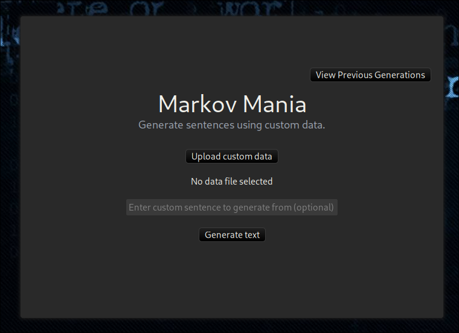

# MarkovMania

A GTK based app that generates text from custom data.

## Building

1. **Clone the repository and navigate inside**
    ```sh
    git clone https://github.com/yorunoken/MarkovMania && cd MarkovMania
    ```

2. **Build using cargo**
    ```sh
    cargo build
    ```

## Usage

1. **After building, you can run the binary**
   ```sh
   chmod +x ./target/release/MarkovMania
   ./target/release/MarkovMania
   ```

## Screenshots

<div align="center">



</div>
